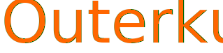

<h1 align="center">Outerkut - Imersão ReactJS</h1>

<a href="https://github.com/DinowSauron/Outerkut" title="Outerkut" >
    <p align="center">
        
    </p>
</a>

<p align="center">
   <a href="#Como-Inicializar">Como Inicializar</a>&nbsp;&nbsp;&nbsp;|&nbsp;&nbsp;&nbsp;
   <a href="#Comandos-Utilizados">Comandos</a>&nbsp;&nbsp;&nbsp;|&nbsp;&nbsp;&nbsp;
   <a href="https://outerkut.vercel.app/login">Website</a>&nbsp;&nbsp;&nbsp;|&nbsp;&nbsp;&nbsp;
   <a href="/LICENSE">Licença</a>
</p>


Este projeto é um aplicativo de rede social onde é necessário "logar" na sua conta do github e com isso pode ver seus seguidores/amigos/comunidades, tudo isso incrementando uma API local e a API do github junto com o banco de dados do DATO CMS.

Note que o projeto foi feito no evento da Alura chamado **Imersão React #2** porém eu decidi mudar o nome do projeto e seu estilo, além das alterações no código.

Acesse agora mesmo o projeto na Vercel [clicando aqui](https://outerkut.vercel.app/login)


<a href="https://github.com/DinowSauron/Outerkut" target="_blank">
    <p style="display: flex; margin-top: 60px" >
        
        
    </p>
    <p style="display: flex; margin-top: 20px">
        
        
    </p>  
</a>

*Note que o login pega as informações publicas, nenhuma senha é necessária, pois a api consulta as informações publicas do seu login(nome, seguidores, etc), nenhuma senha é pedida e nem obtida pelo programa, pois ele não precisa!*

---

## Tecnologias Utilizadas:

* HTML5.
* CSS3.
* ReactJS.
* NEXT JS.
* DATO CMS.
* GraphQL.
* Cookies [(JWT)](https://jwt.io/).
* Styled components.
* Responsividade.


## Como Inicializar:
* `cd outerkut` Para abrir no diretório correto.
* `yarn install` Instala todas as dependencias
* Crie um arquivo .env.local dentro da pasta [Outerkut](./outerkut/) e coloque sua Autenticação do DATO CMS
    * .env.local 
    ```env
        # DATO CMS
        NEXT_PUBLIC_AUTH=DatoReadOnlyToken
        FULL_ACESS_TOKEN=DatoFullAcessToken
        
        COOKIE_TOKEN=Any256BitKeyToken   
        ABSOLUTE_PATH=YourProjectURL #(http://localhost:3000) 
    ```
    * No [DATO CMS](https://www.datocms.com/), crie o seguinte modelo, com o nome exatamente igual, todos sendo uma string de linha única:
    ```
    Comunity:
        Title* 
        Image URL
        Link URL
        Creator Slug
    ```
* `yarn dev` Para inicializar o projeto.

## Notas Pessoais:
...

O grande diferencial do meu projeto para qualquer outro desta imersão é principalmente a autonomia, pois todas as imagens e servições onde precisava consultar o app da alura da vercel foram substituidos por versões locais, inclusive o gerador de tokens para os cookies e  o sistema de autorização/validação de tokens.

Interresante o fato do projeto estar consultando diversas API, como a do github a do DATO CMS e até mesmo api local.

Fiz minha propia api para gerar o token do usuario.
 
Não tinha gostado do fato das imagens serem carregadas pelo website deles, se o app deles parar de funcionar o meu também iria, então adaptei o código e coloquei as fotos localmente, foi bem trabalhoso mais achei necessário.

* React developer tools for chrome.
* https://www.youtube.com/c/DevSoutinho/videos - Dev Soutino. 
* Reset CSS | Normalize CSS.
* CSS grid garden (Game).
* Spread operator (...Array)
* JWT (Jsonwebtoken)

## DATO CMS Config:

Graph QL:
```GraphQL
    query{
        allCommunities {
            id
            title
            imageUrl
            linkUrl
            creatorSlug
            _status
            _firstPublishedAt
        }
    }
```

## Comandos Utilizados:

* `yarn create next-app --example with-styled-components "Nome do app"` - Criar a aplicação.
* `cd "nome do app"` - entrar na pasta do app.
* `yarn dev` - iniciar servidor de desenvolvimento.
* `yarn add dato-cms` - api do servidor do dato.
* `yarn add nookies` - instalar o pacote nookies.
* `yarn add jsonwebtoken` - instalar o decodificador de token.


## Licença:
Note que este projeto está sob a licensa MIT. Veja o arquivo para mais detalhes: <a href="/LICENSE">LICENSE</a>


